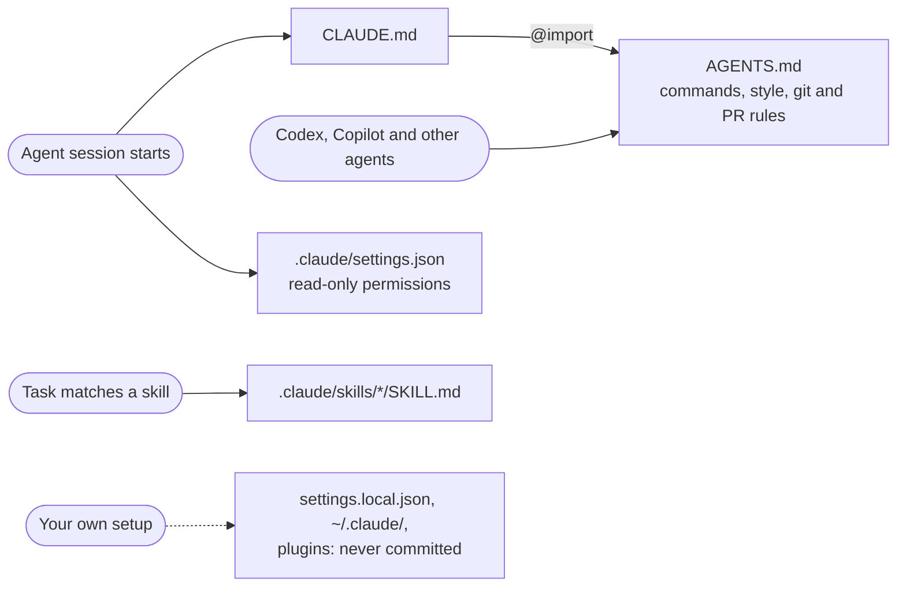

# AI agent files in mesa

mesa keeps only a few AI agent files, and none of them reach the Bioconductor tarball
(`.Rbuildignore` excludes `.claude`, `AGENTS.md` and `CLAUDE.md`). The rule is simple: **the
repo holds what describes the project, and each person's setup stays on their machine.**
You don't need any of this to contribute to mesa.

## What loads when



## Every file

| File | Read by | When | What it does |
|---|---|---|---|
| [`AGENTS.md`](../AGENTS.md) | every agent | each session | Package commands, Bioconductor style, tests, roxygen, NEWS, toolchain rule, git and PR rules, attribution |
| [`CLAUDE.md`](../CLAUDE.md) | Claude Code | each session | One line, `@AGENTS.md`, so Claude reads the same file as every other agent |
| [`.claude/settings.json`](settings.json) | Claude Code | each session | Pre-approves read-only `git`, `gh` and `Rscript -e` commands and blocks reading `.Renviron`. Nothing else |
| [`.claude/.gitignore`](.gitignore) | git | always | Keeps personal files out of the repo: `settings.local.json`, `state/`, `worktrees/` |
| [`.claude/skills/bioc-check-ladder/`](skills/bioc-check-ladder/SKILL.md) | Claude Code | when verifying work | Where `devtools::test`, `R CMD check`, BiocCheck and coverage can run, and how to set up a Mac for them |
| [`…/setup-r-toolchain.R`](skills/bioc-check-ladder/setup-r-toolchain.R) | you or the agent | once per machine | Installs the resolved Bioconductor release, mesa's dependencies, the check tools and the pinned roxygen2 |
| [`.claude/skills/bioc-release-cycle/`](skills/bioc-release-cycle/SKILL.md) | Claude Code | version bumps, releases | The three-phase `X.Y.Z.9000` → `X.Y.(Z+1)` cycle, tagging and the Bioconductor push |
| [`.claude/skills/mesa-tests/`](skills/mesa-tests/SKILL.md) | Claude Code | writing or fixing tests | The cached qseaSet fixtures, the long-check gate and skip guards |
| [`.claude/README.md`](README.md) | people | any time | This page |

Other agents can read the skills as plain Markdown.

## Project vs personal

| Commit it (describes mesa) | Keep it local (describes you) |
|---|---|
| `AGENTS.md`, `CLAUDE.md`, `.claude/settings.json` (permissions only), `.claude/skills/` | `.claude/settings.local.json`, `CLAUDE.local.md`, `~/.claude/`, plugins, output style, hooks that enforce your own workflow |

If you add a file here, add a row to the table above in the same PR.

## Maintainer tooling (optional)

The maintainer's own tooling lives in the private
[`mesa-maintainer`](https://github.com/fpmartinez10/mesa-maintainer) Claude Code plugin. It
has the guardrail hooks, the parking lot, `/mesa-status` (which keeps the #124 roadmap
checklist up to date), `/mesa-sweep`, `pr-review` and three subagents. Maintainers who want
it can ask @fpmartinez10 for access, then run:

```bash
claude plugin marketplace add fpmartinez10/mesa-maintainer
claude plugin install mesa-maintainer@mesa-maintainer
```

The plugin's README lists each of its files and the user settings to add.
